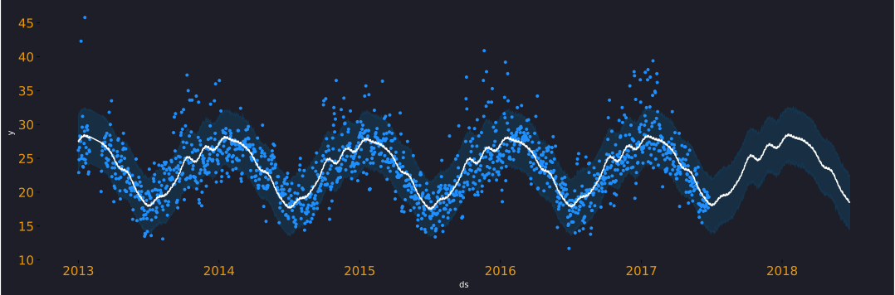

<span style="color:#868686;">Prophet</span> is a time-series forecasting library by <span style="color:#ea9808;">facebook</span> and it's available in Python and in R. It is simple to use and requires very little classical time-series experience, for e.g. ARIMA, SARIMA etc. Thus, you can start <span style="color:#868686;">building models quickly</span>, <span style="color:#868686;">get good results</span> and <span style="color:#868686;">become effective</span> in no time. Considering this, prophet has become a popular library for time-series applications.

!!! abstract

    Lorem ipsum dolor sit amet, consectetur adipiscing elit. Nulla et euismod
    nulla. Curabitur feugiat, tortor non consequat finibus, justo purus auctor
    massa, nec semper lorem quam in massa.

A model in prophet is defined by the following equation. 
This form is called general additive model, since we adding results from each of the components to get our prediction.
$$
\widehat{Y}_t = g_t + s_t + h_t + x_t + \epsilon
$$

$ \hat Y_t $ is the prediction.

$ g_t $ stands for the growth model, i.e., trend (logistic/linear).

$ s_t $ models seasonality using Fourier series.

$ h_t $ models holiday effects.

$ x_t $ represents any extra regressors.

$ \epsilon $ represents normally distributed errors.


## What is this post about ?
In this first post on prophet ,my objective is simply to get you started with <span style="color:#ea9808;"> forecasting</span>. I aim to cover the very basic to get you off the ground. In this series of posts, the aim is to cover all the features of prophet in parts. We will explore under-the-hood mathematics that defines prophet and tinker with how it's applied in code. For now, I will make sure that after reading this you know enough to get your first time-series model up and running. 

<span style="color:#868686;"> All the code required to run the model is available on GitHub</span> [<span style="color:#ea9808;">here</span>](https://github.com/shoaibkhanz/fbprophet_case_studies/tree/master/Part1)

## Dataset
<span style="color:#ea9808;">Time-series data is where the values are recorded sequentially with respect to time</span>, for e.g. temperature data or health tracker data etc. For this post, we will model maximum temperature data for Sydney, Australia between the years 2013-2017 and we want to forecast it another year. This data has a strong seasonal pattern with a weak trend (Fig1). If at this point you are wondering what do we mean by seasonality and trend then you must read [time-series patterns by rob hyndman](https://otexts.com/fpp3/tspatterns.html) before reading any further.

## Setting up to explore and forecast

We want to set up our environment with libraries that we would need for this forecasting exercise.
So, we install the necessary packages below.

``` python
# Importing the libraries
import pandas as pd #for data manipulation
import matplotlib.pyplot as plt #for plotting
from fbprophet import Prophet #for forecasting

```

We then read our data which is stored as a `csv`.
This data contains around 24 variables but we are interested in 2 variables <span style="color:#DC143C;">MaxTemp</span> since its the target and the <span style="color:#ea9808;">Date</span> variable as it's the primary time sequence. Prophet requires the date variable to be set as a <span style="color:#ea9808;">datetime</span> object and so we must convert it so. However, the interesting thing here is that we must name our date variable as <span style="color:#ea9808;">ds</span> and the target variable as <span style="color:#DC143C;">y</span>, this is how prophet expects  them to be.


``` python
# reading a csv
df = pd.read_csv('../datasets/ausraindata.csv')
# converting the string to datetime object
df['ds'] = pd.to_datetime(df['Date'])
# creating a new variable y 
# i.e. target variable, same as MaxTemp
# If you wanted to, you could rename it as well.
df['y'] = df['MaxTemp']
```

The data contains temperature values for many locations across Australia, We are going to filter, select on Sydney, and extract data from 2013 onwards.


``` python

# filtering the data by 2 conditions
df = df.loc[(df['Location']=='Sydney') & 
(df['ds'].dt.year >=2013),:]
# selecting the required variables
df = df.loc[:,['ds','y']]

```

As we feel the need to plot the time-series to understand how the maximum temperature (<span style="color:#868686;">measured in Celsius degrees</span>) has been across these years. We observe that it has peaks and valleys which we should expect as the temperature drops during winters and increases back up during summers. Thus, it's seasonal and we should expect the model to detect this pattern.

``` python
#plotting the time-series
fig, ax = plt.subplots(figsize = (15,4))
ax.plot(df['ds'], df['y'])
ax.set_title('Max Temperature in Sydney from 2013-2017')
plt.show()
```


## Fitting a Prophet model

We have the data ready containing only 2 variables i.e. <span style="color:#ea9808;">ds</span> and <span style="color:#ea9808;">y</span> and this is sufficient to build our very basic prophet model.
The first step is to instantiate the model by calling Prophet class and define seasonality. 

After creating the `m1` object we fit it to the data. Once, we have completed this step successfully, we must create a forecasting dataframe with future dates using the `make_future_dataframe` method. We use `periods` to define the length of the forecasting dates and then simply predict. Now the `forecast1` dataframe contains train and test data along with the forecast values called `yhat`.

``` python
# training a prophet model 
m1 =  Prophet(daily_seasonality=False, 
              weekly_seasonality=True, 
              yearly_seasonality=True)
m1.fit(df)
future1 = m1.make_future_dataframe(periods=365)
forecast1 = m1.predict(future1)
forecast1.tail()

```

<span style="color:#868686;">forecast1</span> dataframe multiple variables but the key variables we focus for now are <span style="color:#ea9808;">ds,trend,weekly,yearly and yhat</span>

$ \hat Y = $ trend + weekly + yearly 


| ds         | trend     | weekly    | yearly    | yhat      |
|------------|-----------|-----------|-----------|-----------|
| 2018-06-21 | 24.032494 | 0.156514  | -5.219729 | 18.969280 |
| 2018-06-22 | 24.032998 | 0.007727  | -5.289494 | 18.751232 |
| 2018-06-23 | 24.033502 | -0.059232 | -5.356488 | 18.617783 |
| 2018-06-24 | 24.034006 | -0.119039 | -5.420102 | 18.494865 |
| 2018-06-25 | 24.034510 | -0.024526 | -5.479695 | 18.530289 |

## Predictions, Trend and Seasonality

Prophet provides some useful functions to plot data. there are 2 backends avaiable `plotly` and `matplotlib`. We use matplotlib to plot the predictions. The function plots 95% confidence intervals as well. The <span style="color:#ea9808;">predicitons</span> are plotted as a <span style="color:#ea9808;">line</span> and the <span style="color:#868686;">actuals</span> as <span style="color:#868686;">points</span>. You could easily plot it yourself if you plotted the `yhat` from the `forecast1` dataframe.

``` python
# plots the predictions
m1.plot(forecast1)

```


If we now wanted to plot <span style="color:#ea9808;">trend</span> and <span style="color:#ea9808;">seasonality</span> from the model we could easily do so by calling the `plot_components` method. We notice that Tuesdays and Thursdays are hotter than others and the values are relatively extremely small, this may suggest that this may not be significant. Interestingly, due to the location of australia, the weather is very different compared to other parts of the world. We observe in the yearly seasonality plot that July is the coldest while December is the hottest.  .

``` python
# plots the trend and seasonality
m1.plot_components(forecast1)

```


## Key Takeaways

I hope after reading this post you are confident to run your basic prophet model and make forecasts about them.
Now there is a lot that I haven't covered here e.g. 

1.) What are changepoints? 

2.) What do we mean by logistic and linear trend?

3.) How is seasonality calculated (Fourier series)? 

4.) Time-series cross-validation and performance metrics etc.

5.) How do you boost model performance? 

<span style="color:#868686;">Future posts in this series</span> will help answer all these questions. My goal for this one was to get you started without making you feel overwhelmed with the features. Once again, all the code is stored [<span style="color:#ea9808;">here</span>](https://github.com/shoaibkhanz/fbprophet_case_studies/tree/master/Part1), there is also a `utils.py` file in the project that gives the appearance of the charts.

Let me know in the comments, if you found this post helpful or you find yourself full of doubts.
