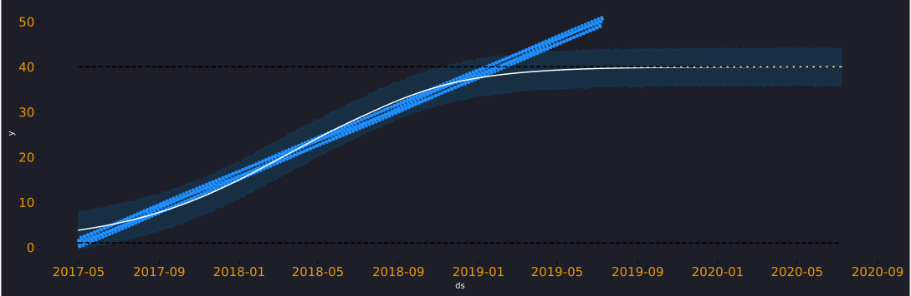
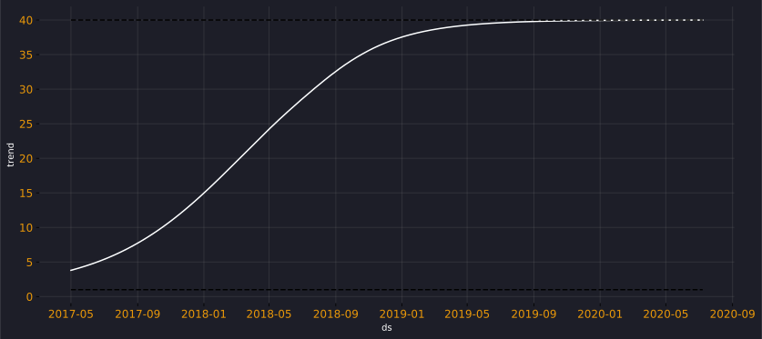

 In the last post, we learned that we can build a simple Prophet model by combining <span style="color:#ea9808;">trend</span> and <span style="color:#ea9808;">seasonality</span> to forecast the future. We saw, that in the model equation not only can we add those factors but we can also include <span style="color:#ea9808;">holidays effects</span> and <span style="color:#ea9808;">extra regressors</span>, which makes it extremely powerful. 


Let's just remind ourselves how this looks like.
$$ 
\widehat{Y}_t = g_t + s_t + h_t + x_t + \epsilon 
$$  


$ \hat Y_t $ is the prediction.

$ g_t $ stands for the growth model, i.e., trend (logistic/linear).

$ s_t $ models seasonality using Fourier series.

$ h_t $ models holiday effects.

$ x_t $ represents any extra regressors.

$ \epsilon $ represents normally distributed errors.


In this post, we will dive deep to understand trend, uncover the 2 options available and how they model trend differently. We will also learn about changepoints that allow the trend to change at specific points. 


## What is trend ?
When we say, we want to extract trend from the data, we essentially are looking to understand the overall trajectory of our time series. We want to know if the series has an <span style="color:#ea9808;">increasing</span> or <span style="color:#868686;">decreasing</span> trend. 

Here are 2 examples of trend. 


Trends are not always increasing or decreasing but they may also consist of changes at points in time. One of the ways trend can be calculated is by computing  <span style="color:#ea9808;">rolling mean</span>. Below we have a weekly rolling mean and it's able to follow the path of our series.


There are 2 ways that trend is calculated in Prophet via  <span style="color:#ea9808;">Linear</span> and  <span style="color:#ea9808;">Logistic</span> growth models. However, logistic growth has more bells and whistles, which makes it more interesting. 

## Logistic growth 

Logistic growth captures non-linear relationship i.e.  <span style="color:#868686;">trend can be curvy</span> and it is also possible to decide saturation values at some defined points. 

You might ask what do we mean by  <span style="color:#ea9808;">saturation</span> ? 

Well, Imagine our company is providing internet services and we have been given a task to  <span style="color:#ea9808;">calculate trend</span>. 

 <span style="color:#868686;">*What a dull exercise but let's just stick with it for now*!</span>

The sales is increasing but we can never out grow the population of the area thus our trend can never increase beyond this threshold, its simply a constraint for our business. This bound is called the  <span style="color:#ea9808;">carrying capacity $C$</span>. 

Population can grow and shrink with time as well, and thus with logistic growth model we can define the bounds of this growth. We could define it as a  <span style="color:#868686;">single value</span> that remains constant for the entire timeseries or we may give different values for different points in time i.e.  <span style="color:#ea9808;">a vector containing different values</span>.

Let's now strip away the complexity and look at the basic form of logistic trend.
$$
g_t = \frac{C}{1+exp(-k(t-m))}
$$

$C$ is the carrying capacity i.e. bounds.

$k$ is the growth rate.

$m$ is an offset parameter.

Here is how, we define it in code to get an intuition.

``` python 
#defining a function
def base_trend(c,k,t,m):
  trend = c/(1+np.exp(-k*(t-m)))
  return trend

#setting values
c = 1000
k = 1
t = np.linspace(1,50,50)
m = 20

```
In the plot, you will observe that it's saturating at $c=1000$, with an offset at $m=20$  <span style="color:#868686;">($m$ allows the graph to move sideways)</span>, $k$ is the initial growth and it determines the curvature of the line. 


Let's just plot another graph like the above but with different values and try to get an intuiton of what's really happening here. 

We have changed the carrying capacity $C$ from 1000 to 100,  <span style="color:#ea9808;">$k$</span> is also changed to 5, which has resulted in a sudden increase in the function, its not as  <span style="color:#ea9808;">smooth as before</span> and finally  <span style="color:#868686;">$m$</span> has caused the graph to shift  <span style="color:#868686;">10 units to the left</span>.

``` python 
#setting values
c = 100
k = 5
t = np.linspace(1,50,50)
m = 10

```


### Changepoints

In the growth function we can define dates where the trend is  <span style="color:#ea9808;">allowed to change</span>, those dates are considered as   <span style="color:#ea9808;">changepoints</span>. Before we look at the mathematical details, let's just take a look at logistic growth model and plot changepoints. 

I have simulated some data and we can see the plot below, we notice it has an increasing trend. 


We will model this and focus on the fit and trend plot while setting seasonality to `False`, I will cover seasonality in detail in part 3. 

In this Prophet model we have set `growth= 'logistic'`, but by default it's always `linear`. The logistic model needs `cap` and `floor` values which define upper and lower bounds respectively. 

``` python 
#training a prophet model by specifying trend 
#i.e. growth function

m1 =  Prophet(growth = 'logistic',
              daily_seasonality=False, 
              weekly_seasonality=False, 
              yearly_seasonality=False)

#defining bounds in the training data
df['cap'] = 50
df['floor'] = 1
m1.fit(df)
future1 = m1.make_future_dataframe(periods=365)

#defining bounds in the testing  data
future1['cap'] = 50
future1['floor'] = 1

forecast1 = m1.predict(future1)

# plotting predictions
fig, ax = m1.plot(forecast1)

# plotting trend 
fig = m1.plot_components(forecast1)

```
Here is the fit plot with the predictions, the black dotted lines are the bounds we had defined for trend.
Please know that these bounds are applied to the trend and not to the final predictions. However, they will have their affect on the predictions because trend is part of it, $$\hat Y_t  = g_t + s_t + h_t + x_t + \epsilon $$.  


In this trend plot you can see how  <span style="color:#ea9808;">cap at 50</span> is restricting the trend, If I change the  <span style="color:#868686;">cap to 40</span> you will see that trend behaves as if it is constrained not to go beyond 40. That's the effect cap and floor have on trend in the logistic growth model (fig 7-9).






Prophet identifies 25 changepoints automatically but by default it only does so for the first 80% of the data. As the user, you have the control to define your own changepoints and also be able control the regularisation <span style="color:#868686;">(using changepoint_prior_scale)</span> applied to them.

Thus, due to regularisation, even when 25 changepoints are considered many changepoint coefficient values is set to near 0. There are fewer than 25 dotted red lines on the plot that's because only changepoints >0.01 are plotted. 


In the below barplot some of the cofficients arent visible on the scale as they are extremely small. We can confirm this if we run --> ```  m1.params['delta] ```

```
array([[ 1.54775876e-08, -4.61800548e-08, -1.00310960e-02,
        -1.18373641e-01, -7.67190921e-01, -1.06926880e+00,
        -1.06480754e+00, -8.54049563e-01, -5.53141018e-01,
        -2.51599717e-01, -5.78373085e-03, -2.55210307e-02,
        -8.98876919e-07, -1.09167994e-07,  1.41241899e-07,
        -4.73692876e-08,  1.44643672e-07,  1.10418832e-06,
         1.68632687e-02,  2.49719169e-03,  1.01259564e-03,
         4.11508165e-01,  9.30539618e-01,  1.37156022e+00,
         1.61753520e+00]])
```


When we consider the logistic growth function with the changepoints, the base formula can then be extended.

We go from here:
$$
g(t) = \frac{C}{1 + \exp(-k(t - m))}
$$

to:
$$
g(t) = \frac{C(t)}{1 + \exp(-(k + a(t)^T \delta)(t - (m + a(t)^T \gamma)))}
$$
It's easy to spot the differences between the 2. The final form consists of <span style="color:#868686;">2 main terms in the denominator</span>, the right most term i.e. <span style="color:#ea9808;">$(t - (m + a(t)^T \gamma))$</span> is defined to make function continous, it's the adjustment for the offset. However, it's the previous term which is important especially <span style="color:#ea9808;">$k + a(t)^T \delta$</span>. 


The $a(t)$ is the place where we define the changepoints and the $\delta$ are the coefficient values that we extracted using ```params```. To conclude our discussion on changepoints, let's just consider an example of how changepoints really work for a simple case.

Let's consider time t as a sequence 1 to 5 and consider we have 2 changepoints, one at <span style="color:#ea9808;">t=2</span> and the other at <span style="color:#ea9808;">t=4</span>. 

We then create <span style="color:#ea9808;">$$a(t)$$</span> as a vector to define these <span style="color:#ea9808;">changepoints</span>. Since we have 2 changepoints we have columns for the vector $a(t)$.

We then say that the first changepoint occurs at t=2 and we set that to <span style="color:#ea9808;">1</span> till the end of the series. Similarly we set the second changepoint to <span style="color:#ea9808;">1</span> at t=4 and in this way we create a vector that defines our 2 changepoints. 
```
 a(1)  =  [0,0] 
 a(2)  =  [1,0] 
 a(3)  =  [1,0] 
 a(4)  =  [1,1] 
 a(5)  =  [1,1] 
```
$\delta$ is a vector that is the amount the slope changes at each of the changepoints. So ```delta=[5, 10]``` means that at the <span style="color:#868686;">first changepoint the slope increases by 5</span>, and at the <span style="color:#ea9808;">second it increases by 10</span>. k is the initial slope, before any changepoints. 

If we set k=2 and then consider calculating <span style="color:#ea9808;">$k + a(t)^T \delta$</span>, use the matrix and values from above. We then have the following

```
t=1: slope is 2 + 0 * 5 + 0 * 10 = 2  # The initial slope
t=2: slope is 2 + 1 * 5 + 0 * 10 = 7  # At the first changepoint, slope increased by 5
t=3: slope is 2 + 1 * 5 + 0 * 10 = 7 
t=4: slope is 2 + 1 * 5 + 1 * 10 = 17  # At the second changepoint, slope increased by 10 more
t=5: slope is 2 + 1 * 5 + 1 * 10 = 17
```
This is how we can calculate logistic trend with changepoints. Linear growth is simpler than this and we discuss it next. 


## Linear growth 

Now that we have understood logistic trend, linear trend becomes fairly simple. The formula for linear growth  should look very similar to logisitc growth but linear trend is linear (see the graph below) and doesnt allow for any trend bounds i.e. carrying capacity. It is defined as below.
$$
g(t) = (k + a(t)^T \delta)t + (m + a(t)^T\gamma)
$$

We can run a simple linear growth model as below, the `changepoint_prior_scale` is a parameter you may use control regularisation, I would encourage you to play with it with your own datasets. 

Essentially, increasing it will make you trend more flexible and reducing it would decrease the flexibility; by default it is set to `0.05`. However, this should be used with caution since more flexibility would mean overfitting the training data and thus poor generalisation.

```` python 
m3 =  Prophet(growth = 'linear',daily_seasonality=False, 
              weekly_seasonality=False, 
              yearly_seasonality=False,changepoint_prior_scale=1.05)
m3.fit(df)
future3 = m3.make_future_dataframe(periods=365)
forecast3 = m3.predict(future3)

````


## Key takeaways

In this post, we have learned not only, how to run trend models in Prophet but  <span style="color:#ea9808;">how to think about them</span>. We looked at how prophet considers changepoints and regularisation when calculating trend. We  <span style="color:#ea9808;">examined</span> various graphs and equations. We also calculated trend in an example setting to see  <span style="color:#868686;">"how it works under the hood"</span>.

In this effort to introduce time series using prophet, I have started to maintain a repository at GitHub, by no means it's complete. However here is the [link](https://github.com/shoaibkhanz/fbprophet_case_studies) to the notebooks. 

I hope you found this useful and as always,  <span style="color:#ea9808;">Happy Forecasting !</span>


References:
[https://github.com/facebook/prophet/issues/1289](https://github.com/facebook/prophet/issues/1289)
[https://facebook.github.io/prophet/](https://facebook.github.io/prophet/)
[https://peerj.com/preprints/3190/](https://peerj.com/preprints/3190/)


